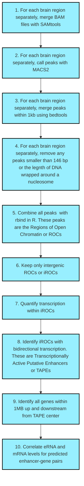

# **Enhancer RNAs predict enhancer-gene regulatory links and are critical for enhancer function in neuronal systems**

This page contains bash and R code, as well as SeqMonk workflow information, for the enhancer identification pipeline used in "Enhancer RNAs predict enhancer-gene regulatory links and are critical for enhancer function in neuronal systems"  

## **General Enhancer Identification Workflow**

The diagram below outlines a general workflow for the identifcation of enhancers. Code corresponding to each step can be found within a directory above. Additional, detailed information can be found within the methods section of the manuscript. 

## **NGS Experimental Details**

RNA-Seq and ATAC-Seq datasets were generated from striatal, cortical, and hippocampal primary neuron cultures treated with 10mM KCl or a vehicle solution for one hour on DIV11. Library preparation details can be found in the methods section of the manuscript. 

## **Citation**

Nancy V.N. Carullo, Robert A. Phillips III, Rhiana C. Simon, Salomon A. Roman Soto, Jenna E. Hinds, Aaron J. Salisbury, Jasmin S. Revanna, Kendra D. Bunner, Lara Ianov, Faraz A. Sultan, Katherine E. Savell, Charles A. Gersbach, Jeremy J. Day. Enhancer RNAs predict enhancer-gene regulatory links and are critical for enhancer function in neuronal systems. 2020. *Nucleic Acids Research*. doi: https://doi.org/10.1093/nar/gkaa671

## **Links**

All Day lab resources may be found at the [Day Lab website](http://day-lab.org/resources)  
[BioRxiv preprint](https://www.biorxiv.org/content/10.1101/270967v3)  
[Published paper](https://academic.oup.com/nar/advance-article/doi/10.1093/nar/gkaa671/5893972)

## **Raw data**

Raw data is available through GEO.
RNA-seq: GSE150499
ATAC-seq: GSE150589

