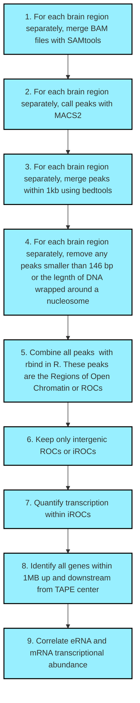

# **Enhancer RNAs predict enhancer-gene regulatory links and are critical for enhancer function in neuronal systems**

This page contains bash and R code, as well as SeqMonk workflow information, for the enhancer identification pipeline used in "Enhancer RNAs predict enhancer-gene regulatory links and are critical for enhancer function in neuronal systems"  

## **General Enhancer Identification Workflow**

The diagram below outlines a general workflow for the identifcation of enhancers. Code corresponding to each step can be found within the repository. 

## **Study design**

snRNA-seq datasets generated here were obtained from two experimental preparations:

1. The rat nucleus accumbens (NAc), with samples taken from four experimental groups:  
	*Male adult rats, 1hr following saline injection  
	*Male adult rats, 1hr following cocaine injection (20mg/kg, I.P.)  
	*Female adult rats, 1hr following saline injection  
	*Female adult rats, 1hr following cocaine injection (20mg/kg, I.P.)  

2. Primary striatal neurons (mixed from male and female E18 rat brains and cultured to DIV11) from four experimental groups:  
	*Vehicle (media alone, 1hr)  
	*Dopamine (50µM, 1hr)  
	*SKF-38393 (1µM, 1hr)  
	*Potassium chloride (25mM, 1hr)  

Datasets in this manuscript used the 10X Genomics Chromium Single Cell 3’ library construction kit to generate barcoded libraries for Illumina sequencing. For each dataset, we provide R Markdown and Word documents containing analysis parameters and code, as well as Python notebooks for generation of enhanced experimental signal (EES) values from the MELD package (Krishnaswamy Lab).  

## **Citation**

## **Links**

All Day lab resources may be found at the [Day Lab website](http://day-lab.org/resources)  
[BioRxiv preprint](https://www.biorxiv.org/content/10.1101/270967v3)  

## **Raw data**

Will be added once deposited on GEO

